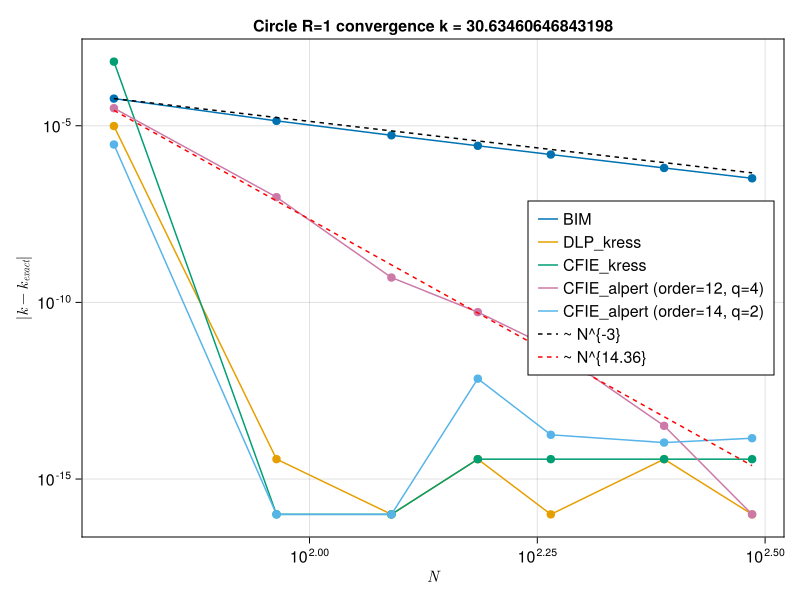
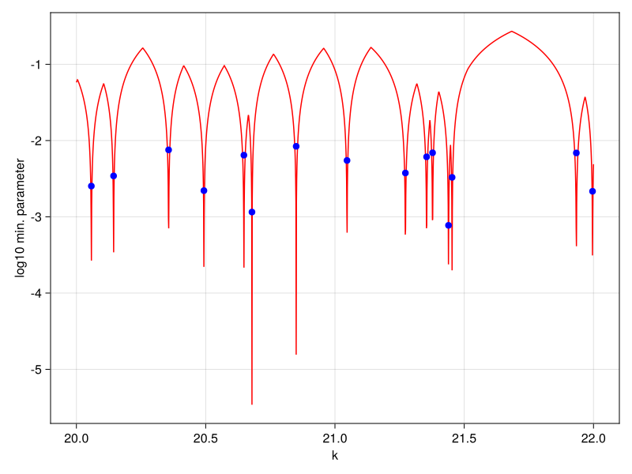
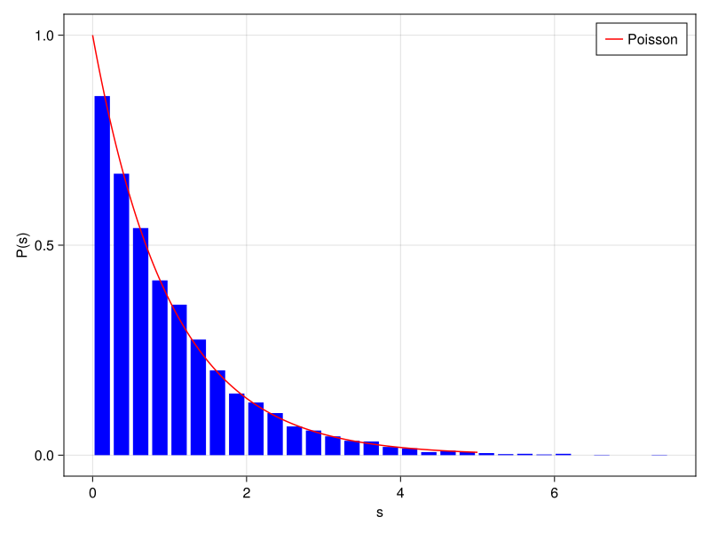
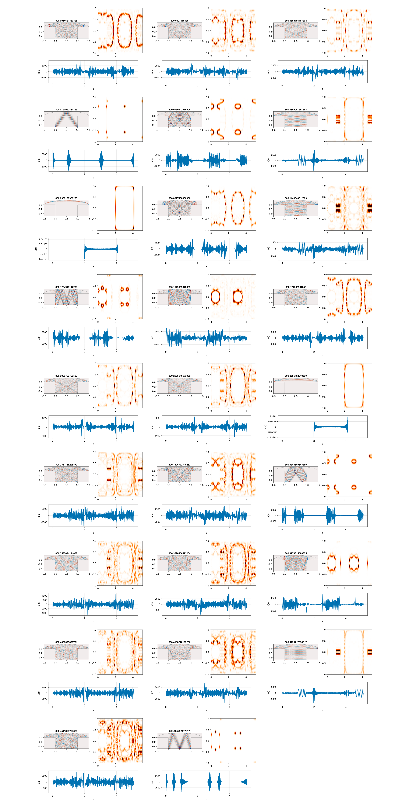

# QuantumBilliards.jl

A Julia library for computing eigenvalues, eigenfunctions and Husimi functions of 2D quantum billiards using boundary integral and basis-expansion methods.

**Manual coming soon!!!**

## Overview

Targets high-frequency spectral computations on smooth and piecewise-smooth domains. It combines:

- Boundary Integral Methods (DLP / CFIE / Alpert)
    1. Boundary Integral Equations in time-harmonic acoustic scattering, Kress R., 1991
    2. (Habilitationsschrift) Eigenfunctions in chaotic quantum systems, Backer A., 2007
    3. HYBRID GAUSS-TRAPEZOIDAL QUADRATURE RULES, Alpert B., 1999
- Local accelerated solvers (EBIM, Vergini–Saraceno)
    1. Calculation by scaling of highly excited states of billiards, Vergini E., Saraceno M. 1995 https://pubmed.ncbi.nlm.nih.gov/9963660/
    2. (PhD thesis) https://users.flatironinstitute.org/~ahb/thesis_html/node71.html, Barnett A.
    3. Expanded boundary integral method and chaotic time-reversal doublets in quantum billiards, Veble et. al., 2006 https://arxiv.org/abs/nlin/0612011
- Contour methods (Beyn)
    1. An integral method for solving nonlinear eigenvalue problems, Wolf-Jürgen Beyn, 2010 https://arxiv.org/abs/1003.1580
- Chebyshev-accelerated kernel assembly
    1. Greengard's hank106.f code - panelization implementation

Focus is on the balance between **performance** and **spectral resolution**, with a high-level API and low-level optimizations.

---

## Methods

### Boundary Integral Methods (DLP / CFIE)

The Helmholtz problem

(Δ + k²) ψ = 0      in Ω

is reduced to

A(k) σ = 0

CFIE variants use

(α I + D(k) + i η S(k)) σ = 0

typically in the presence of holes.

**+** Accurate, flexible, stable
**−** Dense matrices, expensive assembly  

---

### EBIM (Expanded Boundary Integral Method)

Local expansion:

A(k + ε) ≈ A + ε A’ + (1/2) ε² A’’

Solve

A v = λ A’ v

with second-order corrections.

**+** Efficient for medium scale spectrum computations, works with Krylov for GEVP 
**−** Finicky to deal with, requires checking interval size to not lose eigenvalues  

---

### Vergini–Saraceno (Scaling Method)

Basis expansion near k_0:

F c = μ G c

**+** Extremely fast, gets many nearby levels per solve
**−** Basis-dependent, less robust for complex (non-convex) geometries  

---

### Beyn Method

Contour-based extraction:

A_p = (1 / 2πi) ∮ z^p T(z)^{-1} V dz

where we construct A_0 and A_1

**+** Finds all eigenvalues in a region  
**+** Very effective when Vergini–Saraceno fails  
**+** Naturally supports desymmetrized domains via subspace projections (Kress/Alpert)
**−** Slower (not by much) than Vergini–Saraceno, as always needs to form and invert the full size matrix regardles of subspace projection
**−** Requires contour tuning (nq, but it varies slowly and is typically very small around 40-45) along with svd toleranance for A_0, but this is best left to default kwargs

---

### Chebyshev Interpolation

Kernel approximation:

f(x) ≈ Σ a_n T_n(x)

**+** Faster repeated assembly, prioriziting smaller panels with lower degrees
**+** Accuracy is given as a kwarg so that we dont overpanelize when many digits not needed
**−** Slightly higher RAM usage due to panelization  

---

## Geometry

Supports many billiards:
- circle, ellipse, stadium, mushroom, Robnik, star, multi-hole domains
- symmetry-reduced and composite geometries

---

## Practical Guidance

- **Many levels in a small window and large-scale computation →** Vergini–Saraceno  
- **Smaller number of eigenvalues →** EBIM (Krylov for large systems)  
- **Large-scale / difficult spectra →** Beyn  
- **Assembly dominates →** Chebyshev interpolation  

In practice:
- VS is fastest when it applies.
- Beyn is the most robust fallback and works on desymmetrized domains for all BIE type solvers.
- EBIM is best for systematic checking in medium sized intervals.

---

## Symmetries

Symmetry reduction reduces problem size and improves performance, but:

- the spectrum splits into symmetry sectors -> removing degeneracies.
- level counting must match the reduced domain -> only get parts of the full spectrum for that irrep.

Some solvers (e.g. Kress, Alpert) assume periodic parametrizations and do not directly support desymmetrization. Beyn provides a natural workaround in these cases, but still requires full matrix assembly and inversion (lu!).

**Use symmetry whenever possible for improved performance and removal of degeneracies**

---

## Typical Workflow

1. Define billiard -> billiard, basis = make_billiard_and_basis(...)
2. Choose solver -> geometry and problem dependant
3. Discretize boundary -> evaluate_points(...) (done internally)
4. Compute spectrum  -> compute_spectrum_beyn(...), compute_spectrum_ebim(...), compute_spectrum_with_state_data(...)
5. Plot wavefunctions or compute boundary functions (normal derivative of wavefunction on boudnary) for Husimi functions

! Check examples folder 

---

## Status

Active development focused on:
- integration into the QuantumChaosJulia ecosystem
    1. https://github.com/Quantum-Chaos-Julia/BilliardGeometry.jl
- neutrino billiards
    1. Relativistic Quantum Chaos in Neutrino Billiards, Dietz B. (https://arxiv.org/pdf/2604.13003)
- Hyperbolic kernel - Legendre Q via mpmath and seeding w/ Taylor series center expansion (Done, currently used in a paper, add after publication)  
- Fast computation of high frequency Dirichlet eigenmodes via the spectral flow of the interior Neumann-to-Dirichlet map, Barnett A., Hassell A. 2011 https://arxiv.org/abs/1112.5665
- QBX,QB2X
    1. Quadrature by Expansion: A New Method for the Evaluation of Layer Potentials, Kl¨ockner A., Barnett A., Greendard L., O'Neil M. (https://arxiv.org/pdf/1207.4461)
    2. Quadrature by Two Expansions for Evaluating Helmholtz Layer Potentials, Weed J., Ding. L,... (https://arxiv.org/pdf/2207.13762)
- OTOC, wavepacket dynamics...

## Critical

1. Need to find a better global grading for Kress & Alpert that can handle both joins with and wihtout corners. Currently we have a global grading that works but the accuracy could be improved with a more specialized grading.

2. Poincar\'e - Husimi functions for cornered domains with Kress (and potentially Alpert). Currently implementations exist for only non corner CFIE/DLP solvers with and without holes. Corners give large jumps to the boudnary function that completely skews the PH function, need to regularize it somehow...

3. Fix Evanescent Plane Waves, as currently the CompositeBasis does not work.

## Some pics...

NOTE: All of these are generate from .jl files inside examples/ folder

Convergence to an eigenvalue of the circle with R=1 for various BIE type solvers (DLP kress, CFIE kress, Alpert, naive DLP) showing spectral convergence for the Kress solvers and high order for Alpert along with O(1/N^3) for naive DLP.

Example k_sweep for the Prosen billiard (red line) with the solutions (blue dots) of ebim for the DLP_kress solver. Symmetry was set to nothing as this is what primarily Kress and Alpert solvers are meant for outside Beyn subspace projection.

Spectrum of the desymmetrized XYReflection(-1,-1) ellipse for k in [5,400] showing excellent agreement with Poisson. This is part of examples/example_spectrum.jl

Examples of the wavefucntions and husimis for the ellipse cap mushroom (XReflection(-1) symmetry) for k in [800.0,800.5] using the VerginiSaraceno scaling method. The regular region is very small and can be seen in a few subfigures where the wavefunction lives only in the cap. Also some MUPOs can be seen. The boundary function is purely real.

Examples of wavefunctions and PH functions for the star billiard desymmetrized with Rotation(5,0) (the real irrep) which was done via Beyn's subspace projection. Note that the imaginary part of the u(s) is 0, which is needed since that irrep has real eigenfunctions. In principle this can even be complex with just a global phase shift depending on the SVD conventions (Krylov solve_vect for adjint kernel gives it with a general global phase but it gives correct wavefunctions/PH functions - this pic was made with a slower gesvd call which had the global phase realification built in and returned the deshifted u(s), but this is just cosmetics for wavefunctions/PH functions.)

Examples of a domain with holes, restricted via Beyn's subspace projection to Reflection(-1,-1). It is an example of a mixed type system, where the outer high angular momentum nodes do not see the interior holes and behave like a regular circle billiard. Once it penetrates deeper into the billiard it disperses giving rise to nontrivial patterns with localization.